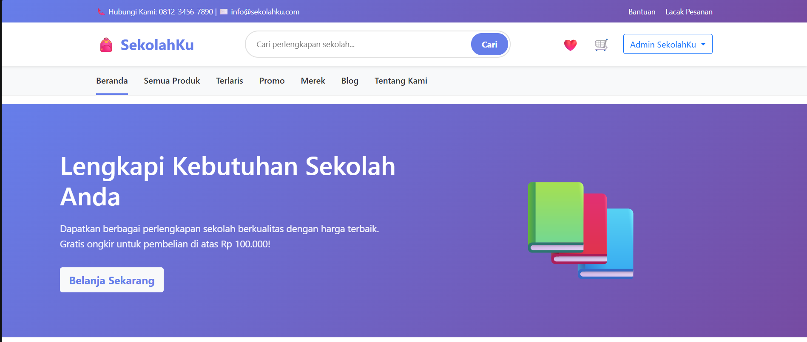
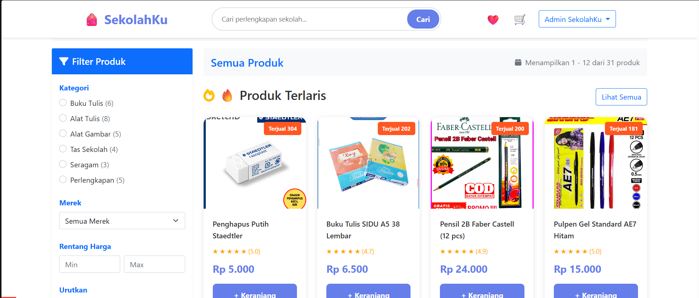
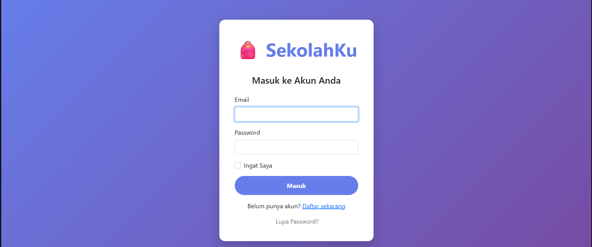
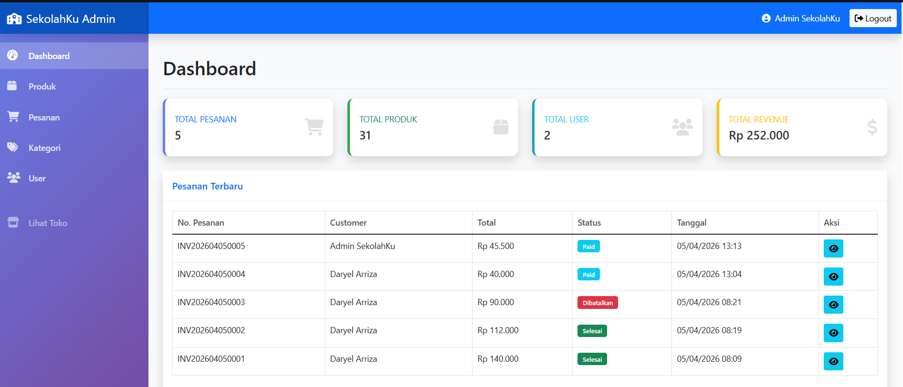
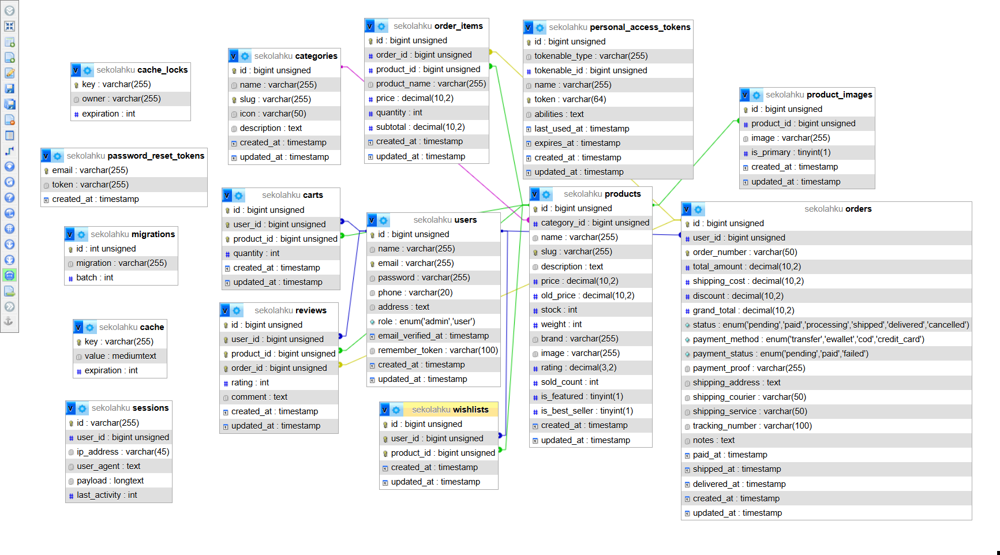

# SekolahKu - E-Commerce Perlengkapan Sekolah

SekolahKu adalah aplikasi e-commerce berbasis web untuk penjualan perlengkapan sekolah. Project ini dibuat sebagai project pengembangan web untuk mempraktikkan alur e-commerce dari sisi pengguna dan administrator, mulai dari katalog produk, keranjang, checkout, pengelolaan pesanan, hingga dashboard admin.

> **Status:** Portfolio / learning project. Beberapa proses seperti konfirmasi pembayaran dibuat sebagai simulasi dan belum terhubung ke payment gateway produksi.

## Preview

### Homepage


### Product Catalog


### Login


### Admin Dashboard


### Database Schema


## Fitur Utama

### Pengguna
- Registrasi, login, logout, dan pengelolaan profil.
- Katalog produk dengan pencarian, filter kategori, merek, rentang harga, dan sorting.
- Halaman produk terlaris dan produk promo.
- Detail produk dan produk terkait.
- Keranjang belanja dengan validasi stok.
- Wishlist produk.
- Checkout dan pembuatan pesanan.
- Pilihan metode pembayaran: transfer, e-wallet, COD, dan kartu kredit sebagai simulasi alur checkout.
- Riwayat dan detail pesanan.
- Pelacakan status pesanan dan nomor resi.
- Konfirmasi penerimaan pesanan.
- Pembatalan pesanan dengan pengembalian stok.
- Review dan rating setelah pesanan selesai.
- Download invoice dalam format PDF.

### Administrator
- Dashboard ringkasan jumlah pesanan, produk, pengguna, dan revenue.
- CRUD produk dan kategori.
- Pengelolaan pesanan dan perubahan status pesanan.
- Pengelolaan nomor resi pengiriman.
- Daftar dan detail pengguna.
- Penghapusan akun pengguna non-admin.

### REST API
Tersedia endpoint sederhana untuk data produk dan kategori:

```text
GET /api/v1/test
GET /api/v1/products
GET /api/v1/products/{slug}
GET /api/v1/products/best-sellers
GET /api/v1/products/promo
GET /api/v1/categories
```

## Tech Stack

- **Backend:** PHP 8.2+, Laravel 12
- **Database:** MySQL
- **Frontend:** Blade, Bootstrap 5, HTML, CSS, JavaScript
- **Icons:** Font Awesome
- **Build tooling:** Vite
- **PDF:** barryvdh/laravel-dompdf
- **API/Auth package:** Laravel Sanctum

## Struktur Data Utama

Project menggunakan relasi database untuk beberapa entitas utama:

- `users`
- `categories`
- `products`
- `product_images`
- `carts`
- `wishlists`
- `orders`
- `order_items`
- `reviews`

Relasi ini mendukung alur transaksi mulai dari pemilihan produk sampai pesanan selesai dan pengguna memberikan review.

## Instalasi Lokal

### 1. Clone repository

```bash
git clone https://github.com/USERNAME/sekolahku-ecommerce.git
cd sekolahku-ecommerce
```

### 2. Install dependency PHP

```bash
composer install
```

### 3. Buat file environment

Windows:

```bash
copy .env.example .env
```

Linux/macOS:

```bash
cp .env.example .env
```

Kemudian generate application key:

```bash
php artisan key:generate
```

### 4. Buat database

Buat database MySQL bernama:

```text
sekolahku
```

Sesuaikan konfigurasi database di `.env` bila diperlukan.

### 5. Migrasi dan seeding

```bash
php artisan migrate --seed
```

Seeder menambahkan kategori, contoh produk, serta akun demo untuk kebutuhan pengujian lokal. Jangan gunakan kredensial demo pada deployment publik/produksi.

### 6. Install dependency frontend

```bash
npm install
npm run build
```

Untuk development:

```bash
npm run dev
```

### 7. Jalankan aplikasi

```bash
php artisan serve
```

Buka:

```text
http://127.0.0.1:8000
```

## Catatan Keamanan

- File `.env` tidak boleh di-upload ke GitHub karena dapat berisi kredensial database, application key, atau konfigurasi sensitif.
- Gunakan `.env.example` sebagai template konfigurasi.
- Ganti kredensial akun demo sebelum aplikasi dipakai di lingkungan publik.
- Alur pembayaran pada project ini merupakan simulasi, bukan implementasi payment gateway produksi.

## Yang Saya Pelajari

Melalui project ini saya mempraktikkan:

- Penerapan pola MVC pada Laravel.
- Perancangan database relasional dan relasi antar-model dengan Eloquent ORM.
- CRUD dan validasi form.
- Authentication, authorization sederhana berbasis role, dan middleware admin.
- Pengelolaan stok dan transaksi database pada proses checkout.
- Pembuatan filter, search, sorting, pagination, wishlist, review, dan order tracking.
- Pembuatan REST API sederhana.
- Pembuatan invoice PDF dari data pesanan.
- Pembuatan dashboard administrator untuk pengelolaan data aplikasi.

## Author

**Daryel Arriza Fyransha**  
Fresh Graduate Rekayasa Perangkat Lunak - 2026

Project ini digunakan sebagai bagian dari portfolio pengembangan web.
